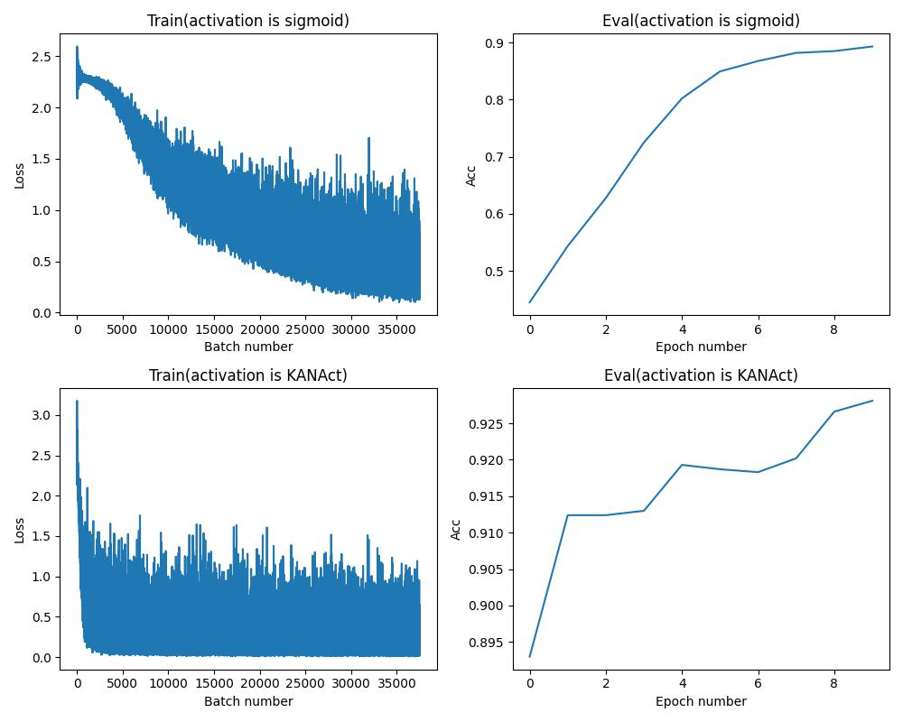

# GaussionKAN based on PaddlePaddle
## Introduction
This is a PaddlePaddle implementation of KAN.

In this project, a Gasussion Distribution is used to replace the original B-branches.

However, the result of directly using KANLayer to test on MNIST is very poor. Based on this, if KANLayer is changed into an optimizable activation function, the test result on MNIST will be very good. In the experiment, I adopted a three-layer fully connected network with Sigmoid as the activation function, and the convergence speed was very slow. After using KANActivation, the convergence was very fast, and an accuracy of 90% could be achieved in only one epoch.




## Notes
The demo use PaddlePaddle(CPU), if you want to use GPU, you need uninstall `paddlepaddle` and install `paddlepaddle-gpu`.

## Usage
install paddlepaddle, if you have gpu, please install `paddlepaddle-gpu`.
```bash
pip install paddlepaddle
```

run the demo.
```python
from KANLayer import KANLayer
import paddle

x = paddle.randn([1, 32])
# 32 input channels, 64 output channels, 8 normal distribution to fit a polynomial
layer = KANLayer(32, 64, 8)
y = layer(x)
print(y.shape)
```
